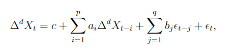

## Постановка задачи

**Задание:** Провести анализ некоторого временного ряда и попробовать предсказать значения для последующих месяцев. В рамках данного задания необходимо:

1) научиться правильно считывать данные и их визуализировать;
2) понять как определять свойства временных рядов и познакомиться с различными моделями для
предсказания значений;
3)оценить качество полученных моделей.

## Описание задачи и решения

**Временной ряд (или ряд динамики)** — собранный в разные моменты времени статистический материал о значении каких-либо параметров (в простейшем случае одного) исследуемого процесса.

**Анализ временных рядов** — совокупность математико-статистических методов анализа, предназначенных для выявления структуры временных рядов и для их прогнозирования.

Выделяют три основных систематических компоненты временного ряда:

1) **Тренд T(t)** - систематическая линейная или нелинейная компонента, изменяющаяся во времени;
2) **Сезонность S(t)** - периодические колебания уровней временного ряда внутри года;
3) **Цикличность C(t)** - периодические колебания, выходящие за рамки одного года. Промежуток времени между двумя соседними вершинами или впадинами в масштабах года определяют как длину цикла.
\end{itemize}

**Случайной составляющей E(t)** называется случайный шум или ошибка, которая воздействует на временной ряд нерегулярно.

**ARIMA** (англ. autoregressive integrated moving average, иногда модель Бокса — Дженкинса, методология Бокса — Дженкинса) — интегрированная модель авторегрессии — скользящего среднего — модель и методология анализа временных рядов.

Модель **ARIMA(p,d,q)** для нестационарного временного ряда $X_{t}$ имеет вид:

где $\epsilon_t$ — стационарный временной ряд; *c,a_i,b_j* — параметры модели; $\Delta^d$ — оператор разности временного ряда порядка $d$ (последовательное взятие $d$ раз разностей первого порядка — сначала от временного ряда, затем от полученных разностей первого порядка, затем от второго порядка и т. д.)

**Тест Дики — Фуллера (DF-тест)** — это методика, которая используется в прикладной статистике и эконометрике для анализа временных рядов для проверки на стационарность. Является одним из тестов на единичные корни. 
